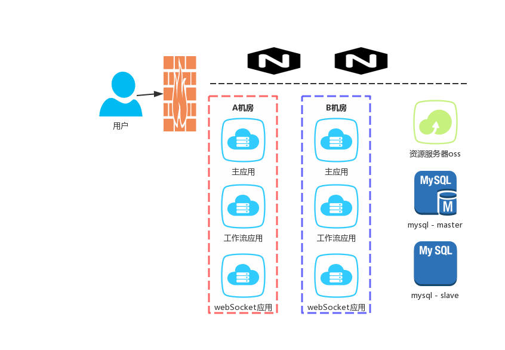

### 宁夏财政集群整合问题


> 宁夏财政版数据规模：单位数-4200，卡片数-659W，用户数-5-7k
>
> 现有服务器配置-应用服务：10C，256G。
>
> 现有服务器配置-IBM小型机（oracle）：10C，46G。


[TOC]

### 现状

#### 应用现状

- 一台应用服务器，部署6个节点，完全隔离。
- 通过NG反向代理实现访问。

#### 数据库现状

- 单台数据库，分为6个表空间。
- oracle通过RAC实现单活主备（存疑）

#### 问题：

##### 根据数据规模确定PV、UV、数据容量，确定TPS（吞吐量）

**计算理论：** 二八原则（每天80%的访问集中在20%的时间里，这20%时间叫做峰值时间)

```java
峰值时间 = 8（工作时间）* 3600s * 20%

pv = uv * 600（单用户每天触发600次请求后台）

tps = pv * 80% / 峰值时间

tps ≈ （7000 * 600）* 80% / 8 * 3600 * 20% ≈ 584
```

 

##### 根据吞吐量估算资源使用量

- 根据计算出的tps确定主应用大概6个节点比较适中。

- 工作流应用双节点容灾。

- webSocket应用双节点容灾。

- web服务器双节点容灾

- FTP服务器一台**（是否使用OSS 如果使用sso 应用要进行改造。）**

> 共：13台ECS

| 应用名称        | 节点数 | CPU  | 内存 | 带宽 | 存储 |
| --------------- | ------ | ---- | ---- | ---- | ---- |
| 主应用          | 6      | 4    | 8    | 10   | -    |
| 工作流          | 2      | 4    | 8    | 10   | -    |
| webSocket       | 2      | 4    | 8    | 10   | -    |
| web服务器 Nginx | 2      | 4    | 8    | 10   | -    |
| FTP/OSS         | 1      | 4    | 8    | 10   | 1T   |


##### 单体变集群，部署架构问题




##### 数据集中，数据拆分问题

> mysql 单表 1000W 4G数据运行良好

新资产数据大小分析

| 表名      | 数据大小 | 数据量  | 数据量 | 问题                                    |
| --------- | -------- | ------- | ------ | --------------------------------------- |
| gams_card | 平均 2Kb | 659W    | 13G    | 60%数据为外键 uuid                      |
| 折旧      | 2kb      | 700W*12 | 168G   | 按月分表 单库（超过一年）容量>300G 分库 |
| 盘点      | 2kb      | 700W    | 14G    |                                         |


### 重点问题及解决方案

- 分库分表如何实现

结合宁夏财政版实际情况，卡片基数不大，仅对折旧、盘点业务进行分库分表，考虑引入sharding-sphere作为主要分库的技术手段。有两种方案供选择

| 方案   | 描述               | 优点                                     | 缺点                                     |
| ------ | ------------------ | ---------------------------------------- | ---------------------------------------- |
| 方案一 | 使用sharding-jdbc  | 实现简单，改造主应用数据源即可。         | 侵入代码，对兼容其它分库分表方案不友好。 |
| 方案二 | 使用sharding-proxy | 对应用透明，应用不需要关注如何分库分表。 | 需要部署代理层，有单点故障风险。         |


---

- 是否引入Spring cloud 方案，改造成微服务架构。

引入 Spring cloud 可以为后期saas化积累经验，使np具备分布式的特点。但是主应用不拆分，主库不拆分，只独立工作流应用和webSocket应用，本质上仍是单体应用，仅仅是交互方式变成了RPC的方式。

该方式也有优点，工作量相对较小，改动方便，风险可控。应用引入Spring cloud相关依赖，改掉交互方式即可实现。

如果引入Spring cloud方案，ECS同时要增加Eureka server 和 zuul。

---

- 分库分表查询效率问题如何解决。

宁夏财政部本身数据量并不大，虽然进行了折旧业务的分表，也是按月拆分，对查询效率影响较小。可不需要接入ES。

---

