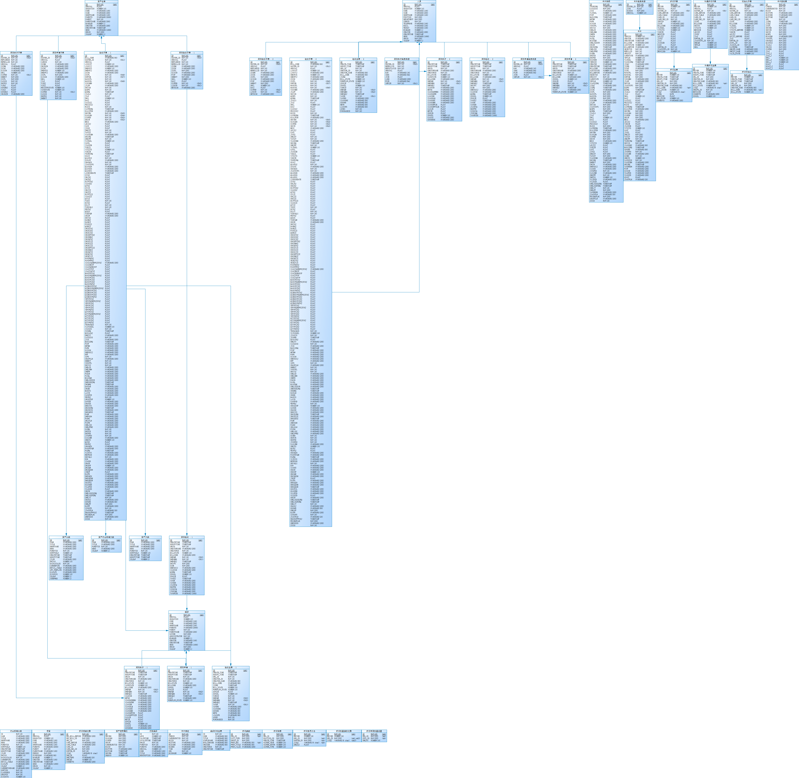

### 表结构及关系

> ER图

### 数据结构

| 模块１       | 模块２               | 表名                       | 描述                 | 关系                 |
| ------------ | -------------------- | -------------------------- | -------------------- | -------------------- |
| 主数据单位表 | 主数据               | GAMS_JC_DEPARTMENT         | 组织                 |                      |
|              |                      | GAMS_JC_PERSONNEL          | 人员                 |                      |
|              |                      | gams_jc_depositary         |                      |                      |
|              |                      | GAMS_JC_FUNDNUMBER         | 项目                 |                      |
|              | 组织机构             | org                        | 组织机构主表         |                      |
|              |                      | org_t_admin                | 行政组织             |                      |
| 卡片表       | 卡片主表             | gams_card                  | 卡片主表             |                      |
|              |                      | gams_card_change           | 卡片变动             |                      |
|              | 子表                 | gams_card_cl               | 车辆卡片             |                      |
|              |                      | gams_card_fw               | 房屋卡片             |                      |
|              |                      | gams_card_gzw              | 构筑物卡片           |                      |
|              |                      | gams_card_jjyjzj           | 家具用具装具卡片     |                      |
|              |                      | gams_card_td               | 土地卡片             |                      |
|              |                      | gams_card_tsda             | 图书档案卡片子表     |                      |
|              |                      | gams_card_tysb             | 通用设备卡片子表     |                      |
|              |                      | gams_card_zysb             | 专用设备卡片子表     |                      |
|              |                      | gams_card_tzdzw            | 特种动植物卡片子表   |                      |
|              |                      | gams_card_wwhclp           | 文物和陈列品卡片子表 |                      |
|              |                      | gams_card_wxzc             | 无形资产卡片子表     |                      |
|              | 痕迹表               | gams_card_trace            | 卡片业务痕迹表       |                      |
|              | ~~锁定表~~           | gams_card_lock             | 资产卡片锁定表       |                      |
|              | ~~卡片标记~~         | gams_card_mark             |                      |                      |
|              | 资产使用情况         | gams_card_useinfo          | 卡片与用户关联关系表 |                      |
|              | 经费来源             | gams_card_outlay           | 卡片与项目关联关系   |                      |
|              | 资产分类             | gams_jc_assetclass         | 资产分类             | 数据字典             |
|              |                      | gams_jc_assetclass_ind     | 行业标准分类         | 。。。               |
|              |                      | gams_jc_assetsort_gb       | 资产大类             | 。。。               |
|              |                      | gams_jc_assetsort_ind      | 资产行业标准大类     | 。。。               |
| 采购业务     | 采购申请             | gams_purchase              |                      |                      |
|              | 子表                 | gams_purchase_detail       |                      |                      |
|              | 采购申请经费来源     | gams_purchase_outlay       |                      | 与项目负责人关联关系 |
|              | 采购执行             | gams_purchasereg           |                      |                      |
|              | 子表                 | gams_purchasereg_detail    |                      |                      |
|              | 采购执行经费来源     | gams_purchasereg_outlay    |                      |                      |
|              | 采购验收             | gams_purchaseaccept        |                      |                      |
|              | ~~子表~~             | gams_purchaseaccept_detail |                      | **有问题**           |
|              | ~~验收子表经费来源~~ | gams_purchaseaccept_outlay |                      |                      |
| 验收入库     | 验收主表             | gams_reimburse             |                      |                      |
|              | 验收子表             | gams_reimburse_detail      |                      |                      |
|              | ~~验收入库发票~~     | gams_reimburse_invoice     |                      |                      |
|              | ~~经费来源~~         | gams_reimburse_outlay      |                      |                      |
| 折旧业务     | 折旧主表             | GAMS_ASSETDEPREC_H         |                      |                      |
|              | 子表                 | GAMS_ASSETDEPREC_I         |                      |                      |
|              | 初始化               | GAMS_ASSETDEPRESSINIT_H    |                      |                      |
|              | 初始化子表           | GAMS_ASSETDEPRESSINIT_I    |                      |                      |
|              | 折旧明细记录         | GAMS_ASSETDEPRECDETAIL     |                      |                      |
|              | 折旧批量修改记录     | GAMS_DEPRESSBATCHEDITLIST  |                      |                      |
|              | 折旧按月汇总表       | GAMS_ASSETDEPSUM_M         |                      |                      |
|              | 账期                 | GAMS_ASSETUNITACCPERREC    |                      |                      |
|              | 折旧年限批量设置     | GAMS_JC_ZHEJNXPLSZ         |                      |                      |
|              | 折旧参数             | GAMS_DEPPARAMS             |                      |                      |
|              | 补提折旧主表         | BIZ_ZY001_BTCJ_H           |                      |                      |
|              | 补提折旧子表         | BIZ_ZY001_BTCJ_I           |                      |                      |
|              |                      |                            |                      |                      |
|              |                      |                            |                      |                      |
|              |                      |                            |                      |                      |
|              |                      |                            |                      |                      |
|              |                      |                            |                      |                      |
|              |                      |                            |                      |                      |
|              |                      |                            |                      |                      |

